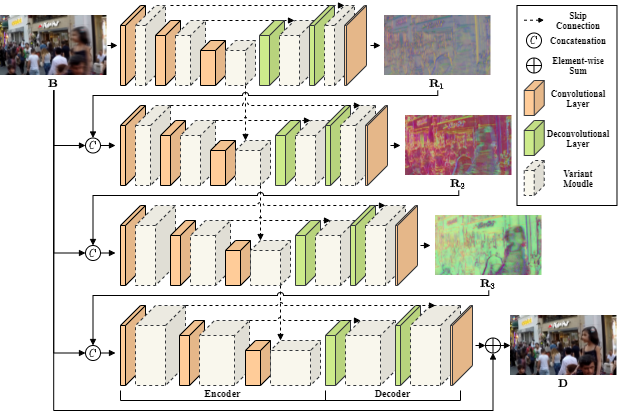
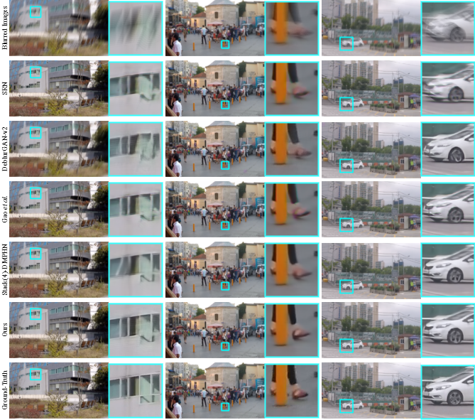
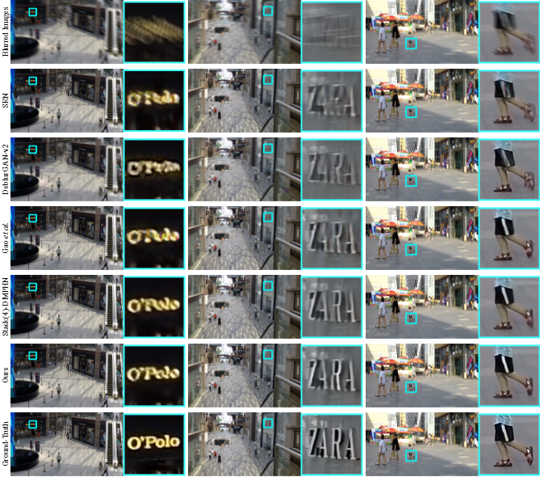

# VDN: Variant-Depth Network for Motion Deblurring
by Cai Guo, Qian Wang, [Hong-Ning Dai](https://www.henrylab.net), [Ping Li](https://www.comp.polyu.edu.hk/~pinli).

Pytorch Implementation of CASA2022 "VDN: Variant-Depth Network for Motion Deblurring"


### Results on the GoPro evaluation dataset


### Results on the HIDE evaluation dataset


## Dependencies
python
```
conda create -n vdn python=3.8
conda activate vdn
```
pytorch
```
conda install pytorch==1.8.0 torchvision==0.9.0 torchaudio==0.8.0 cudatoolkit=11.1 -c pytorch -c conda-forge
```

## Testing
Please copy test samples into './test_samples'. Then running the following command.
```
python test.py
```

## Citation
If you think this work is useful for your research, please cite the following paper.

```
@article{guovdn,
title = {VDN: Variant-depth network for motion deblurring},
author = {Guo, Cai and Wang, Qian and Dai, Hong-Ning and Li, Ping},
journal = {Computer Animation and Virtual Worlds},
volume = {33},
number = {3-4},
pages = {e2066},
publisher={Wiley Online Library},
doi = {https://doi.org/10.1002/cav.2066}
}
```
